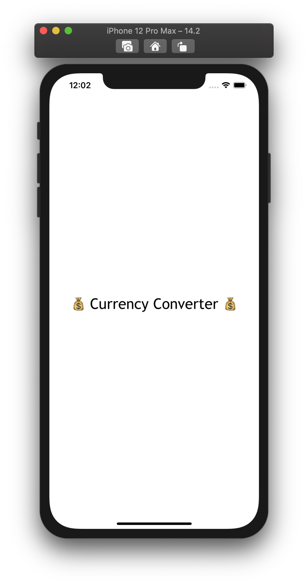
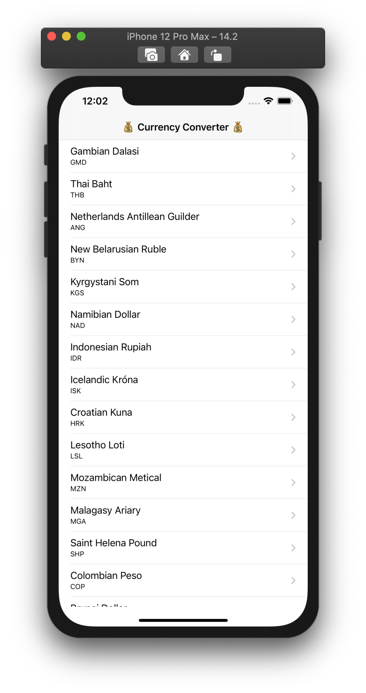
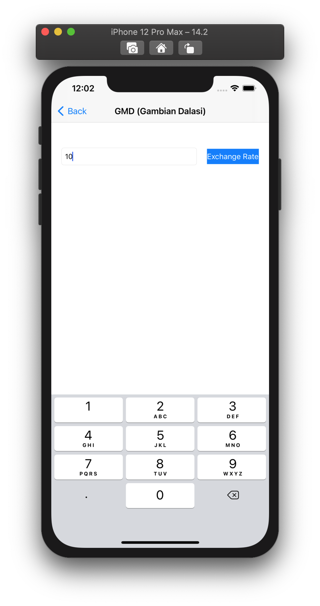
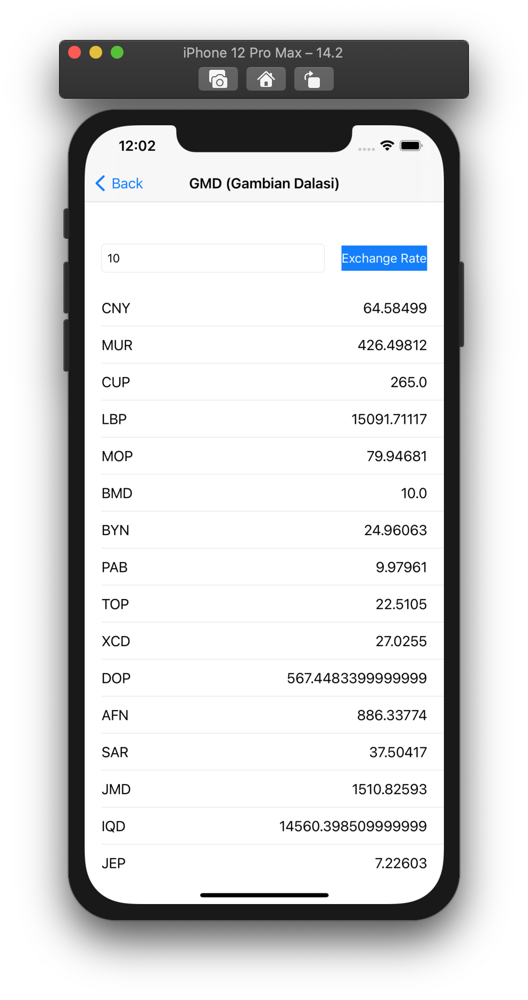
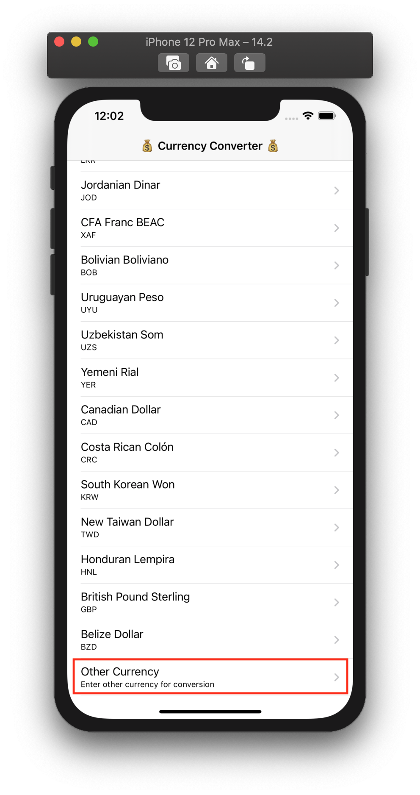
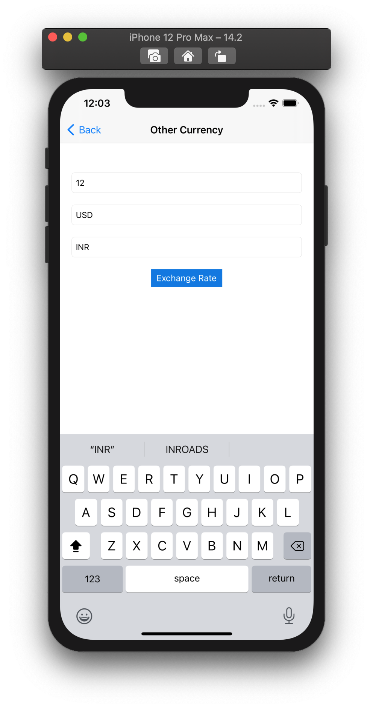
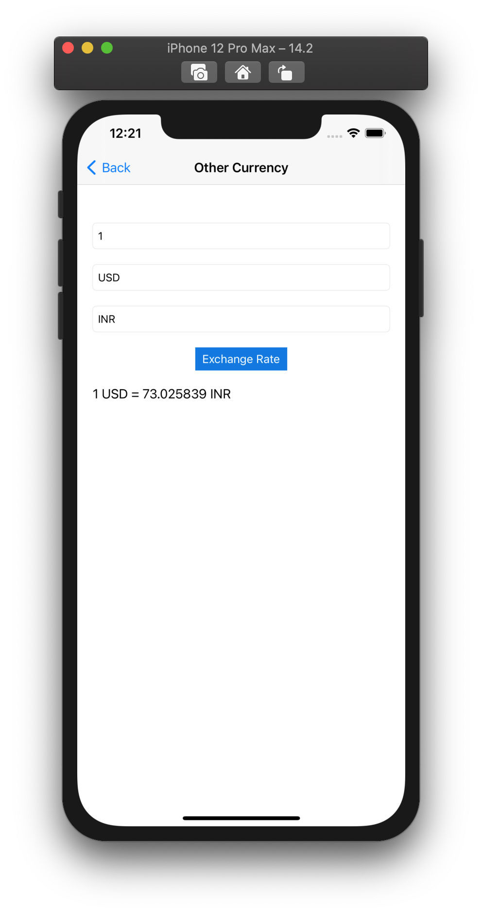

# Currency Converter

This is iOS Currency Converter App where Exchange rates are fetched from: https://currencylayer.com/documentation (for fetching the quotes for selected Currency) and https://free.currencyconverterapi.com/ (for converting the Currency from Source to destination currency).

# Technology Details
1. **Language** - Swift 5.3
2. **Xcode Version** - 12.2
3. **Architecture design pattern** - [MVVM - Model View ViewModel](https://github.com/yo2bh/Design-Pattern-in-iOS/tree/master/MVVM)
4. **No third party library used**
5. **Screen** - Available currency list, Currency conversion for available currency and custom currency conversion
6. **Handled all possible errors**

# Completed below functional requirements
1. Exchange rates are fetched from: https://currencylayer.com/documentation.
2. Used free API Access Key for using the API.
3. Users are able to select a currency from a list of currencies provided by the API.
4. The User is able to enter the desired amount for selected currency.
5. The User is able to see a list of exchange rates for the selected currency from the available currency list.
6. Rates are persisted locally in file and refreshed after every 30 minutes.
7. Written the unit test cases.

# Note
**Currently I am using the free plan, hence not getting exchange rate rather currency except "USD". 
For testing you can set the selectedCurrency in ListedCurrencyConverterVC.swift file to "USD"**

# Application Flow
1. Launch screen -

2. Available currency list screen - 

3. Select currency from list to get the exchange rates for selected currency.

4. Save the exchanges rates in file and refresh the exchange rate after 30 minutes.

5. Select the **Other currency** option from buttom of the currency list to get the source to destionation currency conversion.

6. Enter the amount, source and destination currency code for conversion.

7. Holla !!! you will get the conversion of currencies.
 

# Thank you !!!
